# Learning the DOM inside out

Follow along of the course by w. Scott Means on linkedin learning.

Code: https://github.com/LinkedInLearning/vanilla-js-DOM-2876283

## Key DOM concepts

- HTML is converted to object tree where the html is parsed and every element is stored in a *node* where each node references its parent-, child and sibling nodes as well as the ownerDocument.

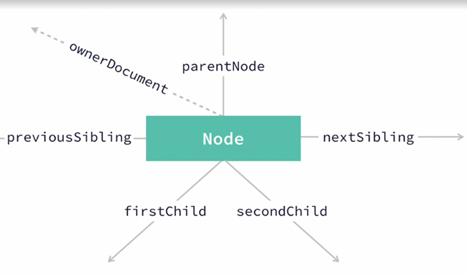

- `ownerDocument`
- `parentNode`
- `previousSibling`, `nextSibling`
- `firstChild`, `secondChild`

### Useful node properties

#### nodeType

The type of a node is accessible in `node.nodeType`

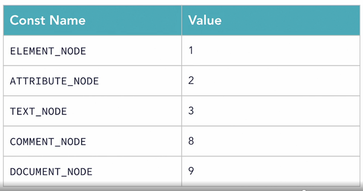

`ATTRIBUTE_NODE` can only be accessed by the `attributes` property of a node.

#### nodeName

Contains different values for different node types 
- in an `ELEMENT_NODE`, it contains the tag name
- `ATTRIBUTE_NODE`: attribute name
- `TEXT_NODE`: the text

#### nodeValue

The `node.nodeValue` attribute provides a way to get the node content as a string.

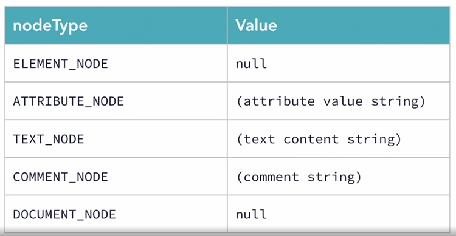

### DOM specific maps and lists

Properties like `node.children` return `HTMLCollection` and not plain arrays and thus don't have methods like `.map` and `.foreach` by default. To use these, wrap them in `Array.from(node.children).forEach(/*...*/)` OR invoke an array method on the `HTMLcollection` using `Array.prototype.forEach.call(node.children, (n) => /* ... */)`

See [./code/01_dom_specific_maps_and_lists](./code/01_1_dom_specific_maps_and_lists) for an example.

```javascript
// calculate and will the "total weight" empty cell
// DOMContentLoaded fires when the tree is fuly parsed but before external content
// such as images are loaded
document.addEventListener('DOMContentLoaded', () => {
    const ingredientTableBody = document.getElementById('ingredients');
    let totalWeight = 0;
    Array.prototype.forEach.call(ingredientTableBody.children, (tr) => {

        // if(tr.attributes['id'] === 'totals') { // this doesn't work as attributes['id'] returns an object
        if(tr.id === 'totals') { // this DOES work
            return;
        }
        const secondTd = tr.children[1];
        // note that the text in the td isn't the nodeValue but actually another node!
        const weight = secondTd.firstChild ? secondTd.firstChild.nodeValue.trim() : 0;
        // or
        // const weight = secondTd.innerText
        // + for quick number conversion
        totalWeight += +weight;
    });

    const totalWeightCell = document.getElementById('totals')
        .children[1];
    totalWeightCell.textContent = totalWeight;

});
```

### Random access with querySelector / querySelectorAll

Nothing new here. See [queryall.html](code/01_2_querySelector/queryall.html) for a neat little page to try them out and some comments in [queryall.js](code/01_2_querySelector/queryall.js)


### CRUD in the DOM

Delete example (delete all occurences of *selector*:

```typescript
output.querySelectorAll(selector).forEach((el) => {
    el.parentElement.removeChild(el);
});
```
 
Update example (replace all `a` tags with with their text content):

```typescript
output.querySelectorAll('a').forEach((el) => {
    const text = document.createTextNode(el.innerText);
    el.parentElement.replaceChild(text, el);
});
```

### Challenge

Takeaways:

- (DOM-unrelated): there exist `details` and `summary` elements that make a section collapsible

## HTML to DOM

This section is about writing a diy HTML parser (recursive descent parser).

The `pp-` elements are custom tags (short for pretty printer) that have no meaning outside of this course.

## Transforming the DOM

DOM tree traversal methods:

- Preorder / "document order" (most common); visit order: root, children (parent / children); useful for copying
- Postorder / "bottom up"; visit order: children, root; useful for deleting
- Breadth first / "level order" / "back to front"; visit order: level0, level1, ...; useful for drawing using z-order


Prettyparse Application goal: transform html in syntax-colored html by transforming a DOM tree into another DOM tree with applied styling.

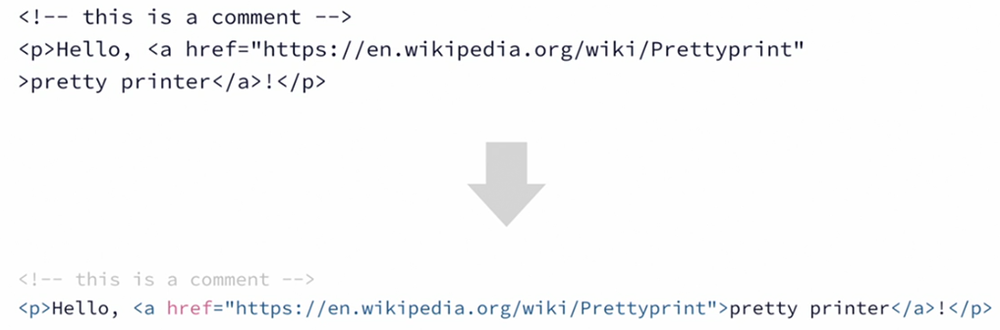

Method: Recursively transform input DOM tree:

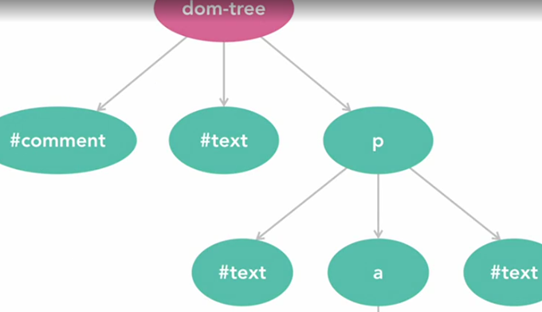

...into fully annotated output tree:

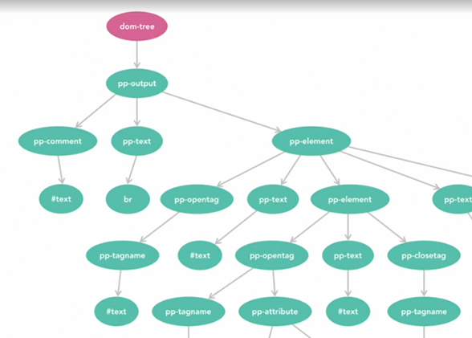

Example: Single comment:

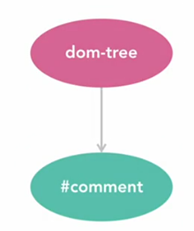

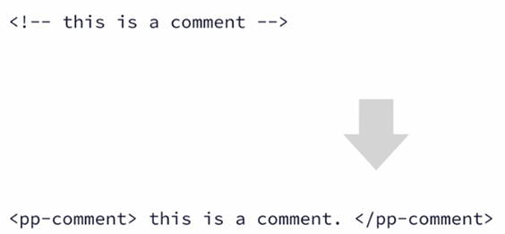

Element nodes are potentially more complex as they can contain attributes, inner text, nested content etc.

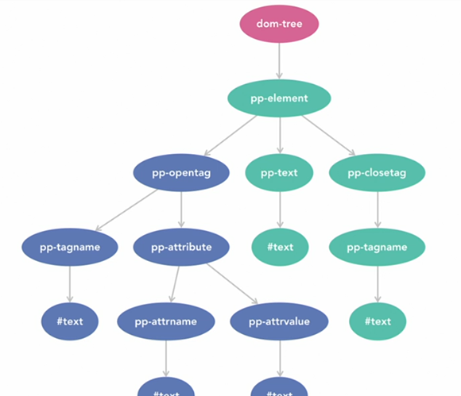

Example: transformation of an `a` element:

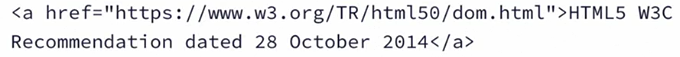

Parsing:

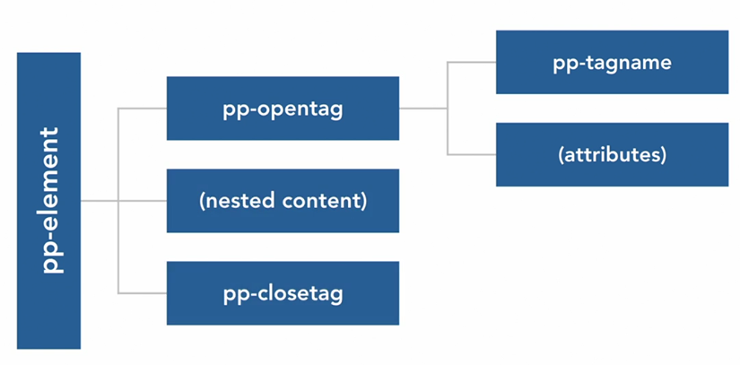

Output:

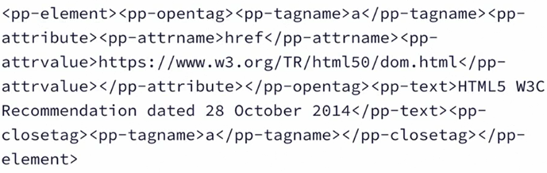


See Full code in [code in 02_1_prettyprinter](./code/02_1_prettyprinter/prettyparse.js)
